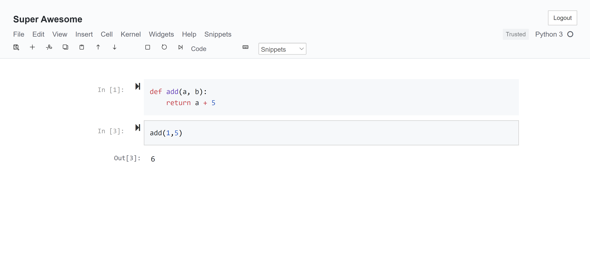
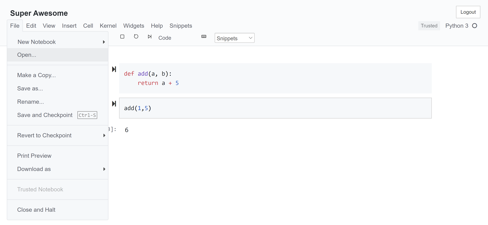

# jupyter-shamrock-theme
GitHub-inspired theme for Jupyter notebook forked from [mmas/jupyter-github-theme](https://github.com/mmas/jupyter-github-theme).

## Installation
  - Install required fonts from `fonts/`
  - Clone or download repository into your Jupyter config folder (e.g. `~/.pyenv/versions/3.7.0/envs/workspace/lib/python3.7/site-packages/notebook/static/custom`)
    - Alternatively, to find your site-packages, run the following in your Jupyter notebook:

```
from distutils.sysconfig import get_python_lib

print(get_python_lib())
```
  
## Screenshots



